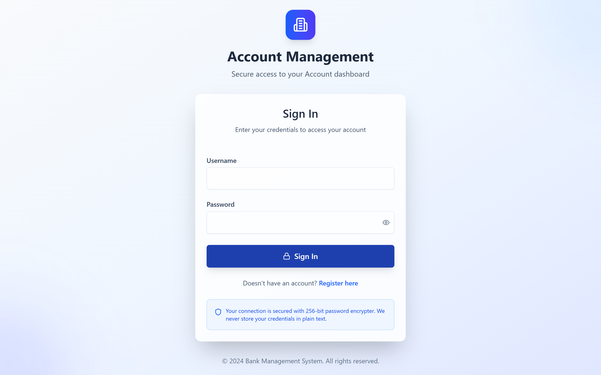
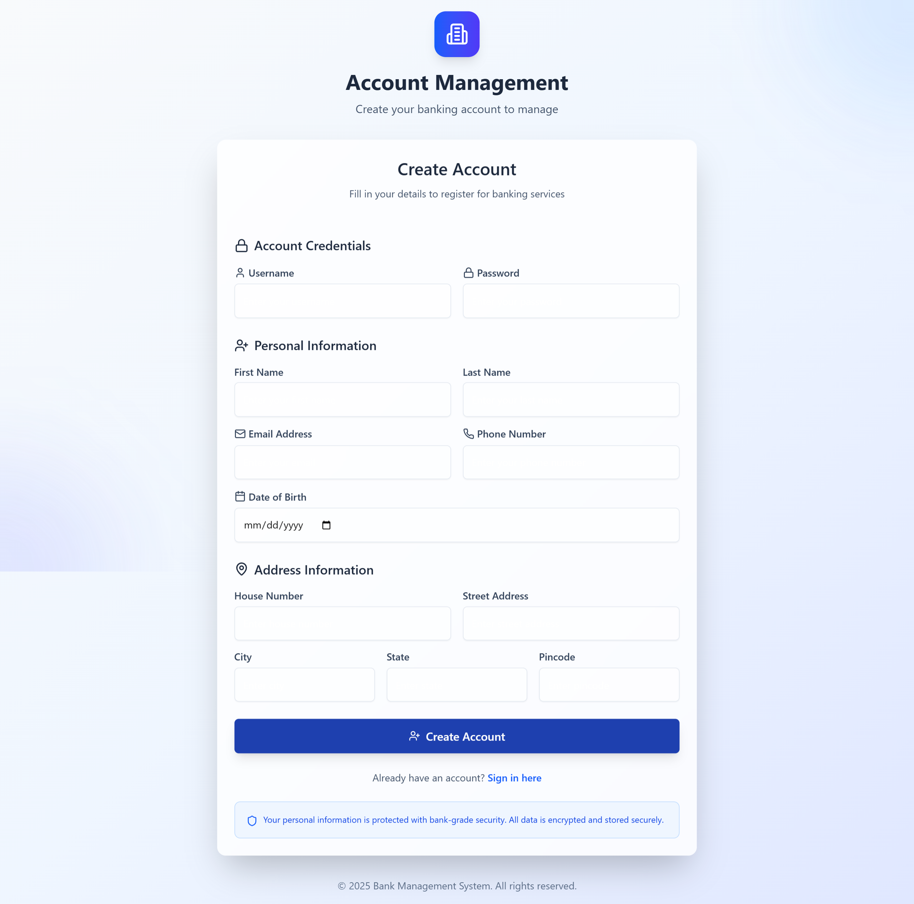
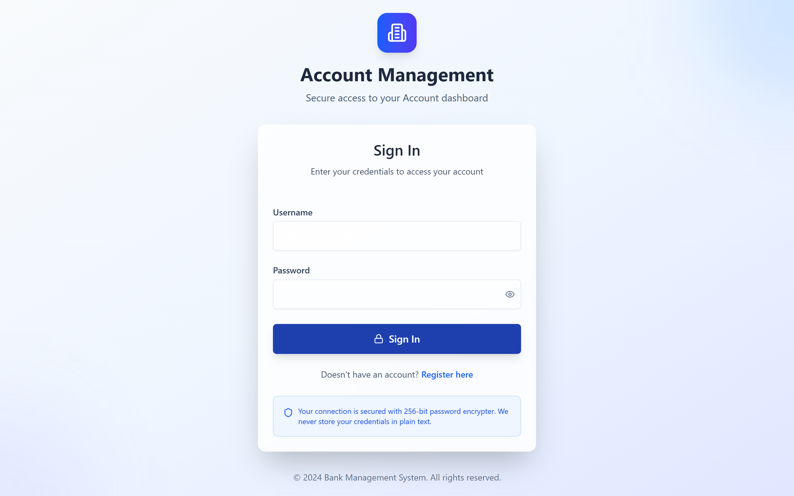
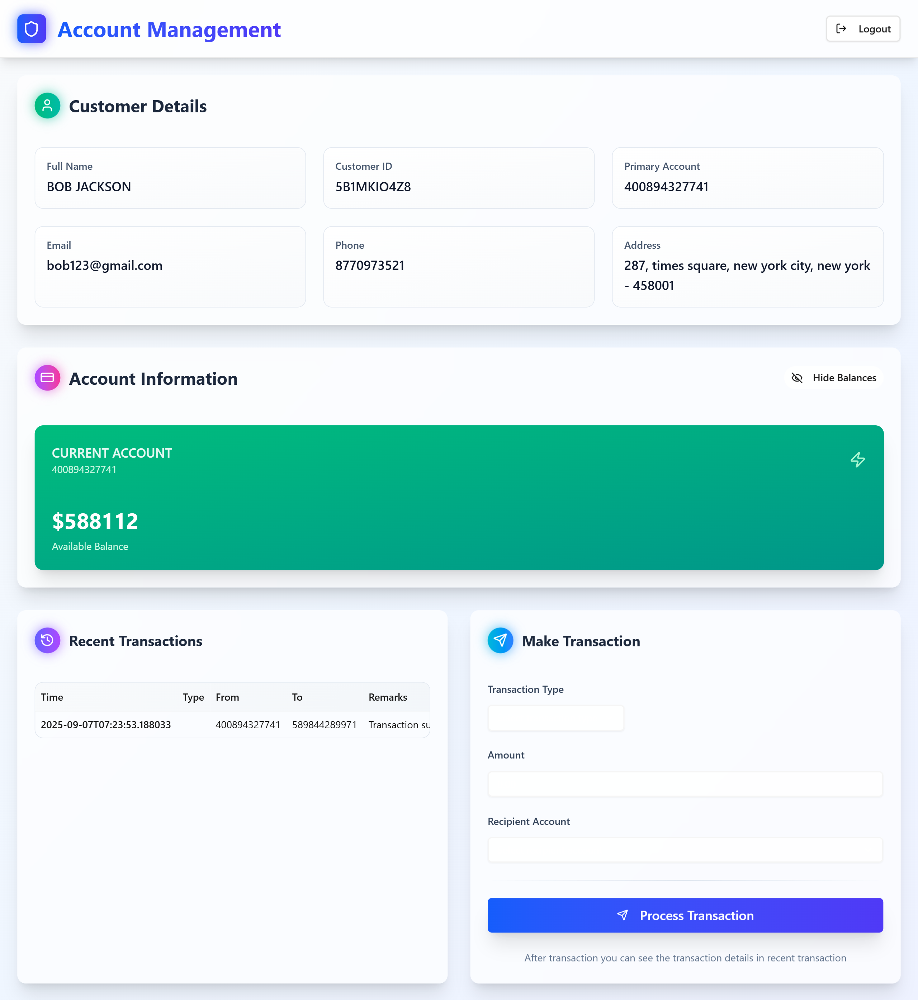

# Account Management System - Frontend

This is the **frontend client application** for the **Account Management System**, built with **Next.js**.  
It connects to the backend microservices implemented in **Spring Boot**, providing a seamless interface to manage bank accounts and transactions.

---

## Features

- **Login** – Secure authentication via `auth-service`.
- **Register** – Create new users and register customer profiles.
- **Account Registration** – Open new bank accounts through `account-service`.
- **Dashboard** – View account details, balance, and transaction history.
- **Transactions** – Transfer funds to active accounts using `transaction-service`.

The frontend communicates with the backend microservices through the **gateway-service** and relies on the **Spring Boot microservices** for all data operations.

---

## Screenshots

### Login Page


### Register Page


### Account Registration Page


### Dashboard


> Replace the paths with actual images of your application.

## Getting Started

### Install Dependencies

```bash
npm install
# or
yarn
# or
pnpm install
# or
bun install
```

## Run Development Server
```bash
npm run dev
# or
yarn dev
# or
pnpm dev
# or
bun dev
```

- Open http://localhost:3000
- in your browser to view the frontend.

## Notes

- The frontend requires the backend microservices which is insides account-management-system to be running via Docker.

- Ensure the gateway-service is accessible at the expected API endpoints for full functionality.

- All transactions and account operations are performed through the backend microservices.
